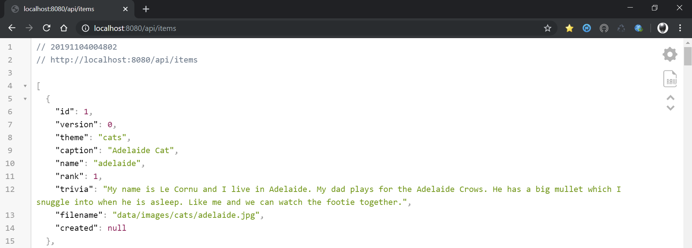

This project showcases a simple web app written using Java Spring Boot 2.2 and which exposes a REST web service which can be used for the **Cat/City of the Day (COTD)** Sample Project. The application metrics are enabled using [Spring Boot Actuator](https://docs.spring.io/spring-boot/docs/current/reference/html/production-ready-features.html) and exposed using the [Micrometer Prometheus](https://micrometer.io/docs/registry/prometheus) so the telemetry can be read into a [Grafana](https://prometheus.io/docs/visualization/grafana) instance.

# Deploy Locally

1. Clone Project

	```
	git clone git@github.com:advlab/erebus.git
	cd erebus
	```

1. Run Project locally

    ```
    mvn spring-boot:run
    ```

1. Test Local URLs

    ```
    http://localhost:8080/api/items
    http://localhost:8080/api/items
    http://localhost:8080/actuator
    http://localhost:8080/actuator/prometheus
    ```

# Deploy on OKD

1. Login to OKD

1. Clone Project

	```
	git clone git@github.com:advlab/erebus.git
	cd erebus
	```

1. Deploy on OKD using S2I

    ```
    oc new-app wildfly:13.0~https://github.com/advlab/erebus.git -l "app=erebus,monitor=true"
    oc expose svc/erebus
    ```

1. Deploy on OKD using Templates

    ```
    oc process -f templates/build-erebus.yml | oc apply -f -
    oc start-build erebus --follow
    ```

# Undeploy from OKD

1. Delete all application objects

    ```
    oc delete all -l app=erebus
    ```

# Test DB Console

* Browse to the DB Console URL (e.g. http://erebus-sandbox.openshift.sytes.net/dbconsole) and use the following properties to connect:

    * Driver Class: `org.h2.Driver`
    * JDBC URL: `jdbc:h2:file:/tmp/testedb`
    * User Name: `sa`, Password: `changeit` or leave empty

# Load Test Pod

1. Load Test Service (e.g. Call API 100 times with 5 concurrent requests at a time)

    ```
    ab -n 100 -c 5 http://erebus-sandbox.openshift.sytes.net/api/items
    ```